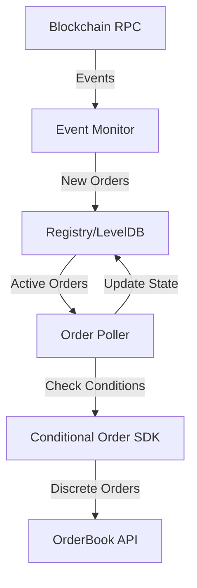

## High-level architecture

The Watch Tower follows an event-driven architecture with three main components:

1. **Event Monitor** - Listens for blockchain events and indexes new conditional orders
2. **Registry/Storage** - Maintains state of all active conditional orders using LevelDB
3. **Order Poller** - Continuously evaluates conditional orders and submits to OrderBook API



## Event monitoring flow

The watch tower monitors the ComposableCoW contract for two critical events:

### ConditionalOrderCreated event

Emitted when a single conditional order is created by a user:

```solidity
event ConditionalOrderCreated(
    address indexed owner,
    IConditionalOrder.ConditionalOrderParams params
)
```

**Processing flow:**

1. Watch tower detects the event via `eth_getLogs` RPC calls
2. Decodes the event data to extract owner address and order parameters
3. Validates the order against filter policies (if configured)
4. Stores the order in the registry indexed by owner
5. Increments metrics for tracking

<Tip>
  The watch tower uses the event topic hash to efficiently filter logs: `keccak256("ConditionalOrderCreated(address,(address,bytes32,bytes))")`. See `/home/daytona/workspace/source/src/services/chain.ts:602`
</Tip>

### MerkleRootSet event

Emitted when a batch of conditional orders (merkle tree) is set for a safe:

```solidity
event MerkleRootSet(
    address indexed owner,
    bytes32 root,
    ComposableCoW.ProofStruct proof
)
```

**Processing flow:**

1. Detects the merkle root event
2. Flushes any existing orders for the owner with different merkle roots
3. Decodes the proof data containing multiple orders
4. Extracts each order's parameters and merkle path
5. Stores all orders with their merkle proofs

From the implementation in `/home/daytona/workspace/source/src/domain/events/index.ts:138-183`:

```typescript
// Decode the proof.data
const proofData = ethers.utils.defaultAbiCoder.decode(
  ["bytes[]"],
  proof.data as BytesLike
);

for (const order of proofData) {
  // Decode the order
  const decodedOrder = ethers.utils.defaultAbiCoder.decode(
    [
      "bytes32[]",
      "tuple(address handler, bytes32 salt, bytes staticInput)",
    ],
    order as BytesLike
  );
  
  // Store with merkle proof
  addOrder(
    event.transactionHash,
    owner,
    toConditionalOrderParams(decodedOrder[1]),
    { merkleRoot: root, path: decodedOrder[0] },
    eventLog.address,
    event.blockNumber,
    context
  );
}
```

<Note>
  Merkle roots allow users to efficiently set multiple conditional orders in a single transaction, reducing gas costs. The watch tower reconstructs each individual order from the merkle proof.
</Note>

## Registry and storage architecture

The watch tower uses LevelDB as its persistent storage layer, chosen for its ACID guarantees and simplicity as a key-value store.

### Database implementation

From `/home/daytona/workspace/source/src/services/storage.ts:8-45`:

```typescript
export class DBService {
  protected db: DBLevel;
  private static _instance: DBService | undefined;

  protected constructor(path = "./database") {
    const options: DatabaseOptions<string, string> = {
      valueEncoding: "json",
      createIfMissing: true,
      errorIfExists: false,
    };
    this.db = new Level<string, string>(path, options);
  }

  public static getInstance(path?: string): DBService {
    if (!DBService._instance) {
      DBService._instance = new DBService(path);
    }
    return DBService._instance;
  }
}
```

### Storage schema

The watch tower maintains the following keys in LevelDB:

| Key | Description | Data Structure |
|-----|-------------|----------------|
| `LAST_PROCESSED_BLOCK_{chainId}` | Last block processed by the watch tower | `{number, timestamp, hash}` |
| `CONDITIONAL_ORDER_REGISTRY_{chainId}` | Map of all active conditional orders by owner | `Map<Owner, Set<ConditionalOrder>>` |
| `CONDITIONAL_ORDER_REGISTRY_VERSION_{chainId}` | Schema version for migrations | `number` |
| `LAST_NOTIFIED_ERROR_{chainId}` | Timestamp of last error notification | `Date (ISO string)` |

### Registry data model

The `Registry` class manages the in-memory and persistent state:

```typescript
export class Registry {
  version = 2;  // Current schema version
  ownerOrders: Map<Owner, Set<ConditionalOrder>>;
  storage: DBService;
  network: string;
  lastNotifiedError: Date | null;
  lastProcessedBlock: RegistryBlock | null;
}
```

Each `ConditionalOrder` contains:

```typescript
type ConditionalOrder = {
  id: string;                    // keccak256 hash of order params
  tx: string;                    // Creation transaction hash
  params: ConditionalOrderParams; // Order parameters (handler, salt, staticInput)
  proof: Proof | null;           // Merkle proof if part of batch
  orders: Map<OrderUid, OrderStatus>; // Submitted discrete orders
  composableCow: string;         // Contract address to poll
  pollResult?: {                 // Last poll result
    lastExecutionTimestamp: number;
    blockNumber: number;
    result: PollResult;
  };
};
```

### Atomic writes

All database writes are batched for atomicity. From `/home/daytona/workspace/source/src/types/model.ts:210-254`:

```typescript
public async write(): Promise<void> {
  const batch = this.storage
    .getDB()
    .batch()
    .put(
      getNetworkStorageKey(
        CONDITIONAL_ORDER_REGISTRY_VERSION_KEY,
        this.network
      ),
      this.version.toString()
    )
    .put(
      getNetworkStorageKey(
        CONDITIONAL_ORDER_REGISTRY_STORAGE_KEY,
        this.network
      ),
      this.stringifyOrders()
    );

  // Write all atomically
  await batch.write();
}
```

<Warning>
  If a write fails, the watch tower throws an error and exits. On restart, it re-processes from the last successfully indexed block, ensuring eventual consistency with the blockchain.
</Warning>

## Order polling and submission

After indexing conditional orders, the watch tower continuously polls them to check if execution conditions are met.

### Polling process

For each block processed, the watch tower:

1. Iterates through all registered owners and their conditional orders
2. Calls the order's `poll` method from the Composable SDK
3. Evaluates the returned `PollResult`
4. Submits discrete orders to the OrderBook API if conditions are satisfied

From `/home/daytona/workspace/source/src/domain/polling/poll.ts:18-52`:

```typescript
export async function pollConditionalOrder(
  conditionalOrderId: string,
  pollParams: PollParams,
  conditionalOrderParams: ConditionalOrderParams,
  chainId: SupportedChainId,
  blockNumber: number,
  ownerNumber: number,
  orderNumber: number
): Promise<PollResult | undefined> {
  const order = ordersFactory.fromParams(conditionalOrderParams);

  if (!order) {
    return undefined;
  }
  
  const actualPollParams = POLL_FROM_LATEST_BLOCK
    ? { ...pollParams, blockInfo: undefined }
    : pollParams;

  return order.poll(actualPollParams);
}
```

<Note>
  By default, the watch tower polls using the current processing block (not latest), since it indexes every block. This ensures consistent state and prevents issues with block reorgs.
</Note>

### Posting to OrderBook API

When a conditional order's conditions are met, the watch tower:

1. Extracts the discrete order parameters from the `PollResult`
2. Signs the order (if required by the order type)
3. Posts to the CoW Protocol OrderBook API using the SDK
4. Records the submitted order UID in the registry
5. Updates metrics

The OrderBook API is initialized per chain:

```typescript
this.orderBookApi = new OrderBookApi({
  chainId,
  baseUrls,
  backoffOpts: {
    numOfAttempts: 5,  // Retry up to 5 times
  },
});
```

## Block processing flow

The watch tower processes blocks in two phases:

### Phase 1: Warm-up (sync)

When starting, the watch tower syncs from the last processed block to the current chain tip:

```typescript
public async warmUp(oneShot?: boolean) {
  let fromBlock = lastProcessedBlock
    ? lastProcessedBlock.number + 1
    : this.deploymentBlock;

  let currentBlock = await provider.getBlock("latest");
  
  // Page through historical blocks
  do {
    toBlock = !pageSize ? "latest" : fromBlock + (pageSize - 1);
    const events = await pollContractForEvents(fromBlock, toBlock, this);
    
    // Process each block with events
    for (const blockNumber of Object.keys(eventsByBlock).sort()) {
      await processBlockAndPersist({
        context: this,
        blockNumber,
        events: eventsByBlock[blockNumber],
      });
    }
    
    fromBlock = toBlock + 1;
  } while (toBlock !== currentBlock.number);
  
  this.sync = ChainSync.IN_SYNC;
}
```

**Key features:**

- **Paging** - Fetches blocks in chunks (default 5000) to avoid RPC limits
- **Ordered processing** - Processes blocks sequentially to maintain state consistency
- **Resume capability** - Starts from last processed block on restart

<Tip>
  The `pageSize` option defaults to 5000 blocks (Infura's limit). If using your own RPC node, set `pageSize: 0` to fetch all blocks in one request for faster syncing.
</Tip>

### Phase 2: Real-time monitoring

Once synced, the watch tower subscribes to new blocks:

```typescript
provider.on("block", async (blockNumber: number) => {
  const block = await provider.getBlock(blockNumber);
  
  // Detect reorgs
  if (blockNumber <= lastBlockReceived.number &&
      block.hash !== lastBlockReceived.hash) {
    log.info(`Re-org detected, re-processing block ${blockNumber}`);
    metrics.reorgsTotal.inc();
  }
  
  const events = await pollContractForEvents(blockNumber, blockNumber, this);
  await processBlockAndPersist({ context: this, block, events });
});
```

**Reorg handling:**

The watch tower detects blockchain reorganizations by comparing block hashes. When a reorg is detected:

1. Increments the reorg counter metric
2. Records the reorg depth
3. Re-processes the reorganized block(s)
4. Updates the registry with the canonical chain state

### Block processing pipeline

For each block, the watch tower executes:

1. **Process new order events** - Index any new conditional orders
2. **Poll existing orders** - Check all registered orders for execution conditions
3. **Submit discrete orders** - Post eligible orders to OrderBook API
4. **Persist state** - Atomically write registry and last processed block

From `/home/daytona/workspace/source/src/services/chain.ts:467-541`:

```typescript
async function processBlockEvent(
  context: ChainContext,
  block: providers.Block,
  events: ConditionalOrderCreatedEvent[]
) {
  // Process new order events
  for (const event of events) {
    await processNewOrderEvent(context, event);
    metrics.eventsProcessedTotal.inc();
  }

  // Poll existing orders and place if conditions met
  const shouldProcessBlock = block.number % processEveryNumBlocks === 0;
  if (shouldProcessBlock) {
    await checkForAndPlaceOrder(
      context,
      block,
      blockNumberOverride,
      blockTimestampOverride
    );
  }
}
```

<Note>
  The `processEveryNumBlocks` option allows you to reduce RPC calls by only polling orders every N blocks. Default is 1 (poll every block).
</Note>

## Multi-chain support

The watch tower can monitor multiple chains simultaneously using parallel chain contexts:

```typescript
const chainContexts = await Promise.all(
  networks.map((network) => {
    return ChainContext.init(
      { ...options, ...network },
      storage  // Shared database instance
    );
  })
);

// Run all chain watchers in parallel
const runPromises = chainContexts.map(async (context) => {
  return context.warmUp(oneShot);
});

await Promise.all(runPromises);
```

Each chain context maintains:

- Independent provider connection (HTTP or WebSocket)
- Separate registry namespace in LevelDB
- Dedicated OrderBook API instance
- Isolated metrics by chain ID

## Monitoring and observability

The watch tower exposes comprehensive monitoring capabilities:

### API endpoints

By default on port 8080:

- **`GET /`** - Root endpoint (returns "🐮 Moooo!")
- **`GET /api/version`** - Version and build information
- **`GET /config`** - Current configuration
- **`GET /api/dump/:chainId`** - Dump registry for a chain
- **`GET /health`** - Health check for all chains
- **`GET /metrics`** - Prometheus metrics

### Prometheus metrics

Key metrics exposed:

```typescript
// Chain sync status
syncStatus.labels(chainId).set(1);  // 0=SYNCING, 1=IN_SYNC

// Block processing
blockHeight.labels(chainId).set(blockNumber);
blockHeightLatest.labels(chainId).set(latestBlock);
blockProducingRate.labels(chainId).set(blockTime);

// Registry state
activeOwnersTotal.labels(network).set(ownerCount);
activeOrdersTotal.labels(network).set(orderCount);

// Order types
singleOrdersTotal.labels(network).inc();
merkleRootTotal.labels(network).inc();

// Reorgs
reorgsTotal.labels(chainId).inc();
reorgDepth.labels(chainId).set(depth);
```

### Logging

Structured logging with configurable levels via `LOG_LEVEL` environment variable:

```bash
# Set root log level
LOG_LEVEL=WARN

# Enable module-specific logging
LOG_LEVEL=WARN,chainContext=INFO,_placeOrder=TRACE

# Use regex patterns
LOG_LEVEL=chainContext:processBlock:(\d{1,3}):(\d*)$=DEBUG
```

### Health checks

The watch tower maintains health status for each chain:

```typescript
static get health(): ChainWatcherHealth {
  return {
    overallHealth: boolean,
    chains: {
      [chainId: number]: {
        sync: ChainSync,
        chainId: SupportedChainId,
        lastProcessedBlock: RegistryBlock | null,
        isHealthy: boolean
      }
    }
  };
}
```

### Watchdog

A watchdog thread monitors for stalled chains:

```typescript
while (true) {
  await asyncSleep(5000);  // Check every 5 seconds
  const timeElapsed = now - lastBlockReceived.timestamp;
  
  if (timeElapsed >= watchdogTimeout) {  // Default 30s
    log.error(`Chain watcher stalled`);
    if (!isRunningInKubernetesPod()) {
      process.exit(1);  // Exit to allow orchestrator restart
    }
  }
}
```

<Warning>
  If running in Kubernetes, the watch tower sets sync status to UNKNOWN instead of exiting, allowing the pod to remain running for debugging. Outside Kubernetes, it exits immediately to trigger a restart.
</Warning>

## Error handling and resilience

### Atomic operations

All state changes are atomic - if any operation fails during block processing:

1. The error is logged and metrics updated
2. Database writes are aborted (batch not committed)
3. Watch tower exits with error code
4. On restart, re-processes from last successful block

### Retry logic

OrderBook API calls include exponential backoff:

```typescript
backoffOpts: {
  numOfAttempts: 5,  // Retry up to 5 times
}
```

### Filter policies

Optional filter policies allow dropping problematic orders before indexing:

```typescript
if (filterPolicy) {
  const filterResult = filterPolicy.preFilter({
    conditionalOrderId,
    transaction: tx,
    owner,
    conditionalOrderParams,
  });

  if (filterResult === policy.FilterAction.DROP) {
    log.info("Not adding the conditional order. Reason: AcceptPolicy: DROP");
    return false;
  }
}
```

## Performance considerations

### RPC optimization

- **Paging** - Configurable `pageSize` to batch historical event queries
- **Block skipping** - `processEveryNumBlocks` option to reduce polling frequency
- **Address filtering** - Optional `owners` config to only monitor specific addresses
- **Connection type** - WebSocket providers reduce latency vs HTTP polling

### Storage optimization

- **Expired orders** - Automatically removed from registry to conserve space
- **Cancelled orders** - Detected and removed during processing
- **JSON encoding** - Uses custom serializers for Map/Set types

### Concurrency

- Multiple chains processed in parallel
- Events within a block processed sequentially for consistency
- Metrics and logging are thread-safe

<Tip>
  For production deployments, use a WebSocket RPC connection for lower latency and reduced overhead compared to HTTP polling.
</Tip>
