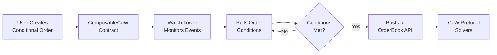

## What is Watch Tower?

The Watch Tower is a standalone application that monitors the blockchain for programmatic orders created through the [CoW Protocol](https://docs.cow.fi/cow-protocol) [programmatic order framework](https://docs.cow.fi/cow-protocol/concepts/order-types/programmatic-orders). It acts as a critical infrastructure component that bridges on-chain conditional orders with the CoW Protocol OrderBook API.

<Note>
  Watch Tower keeps an eye on Composable Cows 👀🐮, automatically detecting new conditional orders and posting eligible discrete orders to the orderbook.
</Note>

## Why does it exist?

Programmatic orders in CoW Protocol allow users to define conditional trading logic on-chain through smart contracts. However, these orders need to be:

1. **Discovered** - The watch tower monitors blockchain events to detect when new conditional orders are created
2. **Evaluated** - It continuously polls conditional orders to check if their execution conditions are met
3. **Submitted** - When conditions are satisfied, it posts the resulting discrete orders to the CoW Protocol OrderBook API

Without the watch tower, programmatic orders would remain dormant on-chain with no mechanism to activate them when their conditions are met.

## How it fits into CoW Protocol

The watch tower serves as the execution layer in CoW Protocol's programmatic orders architecture:



The watch tower operates as a decentralized service - anyone can run their own instance to monitor specific addresses or provide redundancy for the network.

## Key capabilities

### Event monitoring

The watch tower tracks two primary events emitted by the `ComposableCoW` contract:

- **`ConditionalOrderCreated`** - Emitted when a single conditional order is created
- **`MerkleRootSet`** - Emitted when a batch of conditional orders (merkle tree) is set for a safe

### Persistent registry

All discovered conditional orders are stored in a local LevelDB database, maintaining:

- Active conditional orders by owner (safe address)
- Order parameters and merkle proofs
- Last processed block information
- Submitted discrete order status

<Tip>
  The watch tower uses LevelDB for its ACID guarantees. If a write fails, the application exits and automatically re-processes from the last successful block on restart, ensuring eventual consistency.
</Tip>

### Continuous polling

For each registered conditional order, the watch tower:

1. Calls the order's poll method with current block context
2. Evaluates if trading conditions are satisfied
3. Submits discrete orders to the OrderBook API when conditions are met

### Multi-chain support

The watch tower can monitor multiple chains simultaneously, including:

- Ethereum Mainnet
- Arbitrum One
- Gnosis Chain
- Base
- Sepolia (testnet)

## Use cases

### For protocol integrators

Run your own watch tower instance to:

- Monitor specific safe addresses or contracts
- Ensure reliable execution of your users' programmatic orders
- Maintain independence from third-party infrastructure

### For DApp node operators

The watch tower is available as a [DAppNode package](https://github.com/cowprotocol/dappnodepackage-cow-watch-tower), allowing you to:

- Contribute to CoW Protocol's decentralized infrastructure
- Provide redundancy for programmatic order execution
- Support the ecosystem while earning potential rewards

### For development and testing

Use the watch tower locally to:

- Test programmatic order implementations
- Debug conditional order logic
- Validate order execution flow

<Warning>
  Conditional order types may consume considerable RPC calls. Ensure you have access to a reliable RPC endpoint with sufficient rate limits when running a watch tower instance.
</Warning>

## Getting started

The watch tower can be deployed in several ways:

### Docker (recommended)

```bash
docker run --rm -it \
  -v "$(pwd)/config.json:/config.json" \
  ghcr.io/cowprotocol/watch-tower:latest \
  run \
  --config-path /config.json
```

### Local development

```bash
# Install dependencies
yarn

# Run watch tower
yarn cli run --config-path ./config.json
```

### DAppNode

Install the CoW Watch Tower package directly from the DAppNode package manager.

## Requirements

To run your own watch tower instance, you'll need:

- **RPC node** - Connected to your target chain(s) with sufficient rate limits
- **Internet access** - To communicate with the CoW Protocol OrderBook API
- **Storage** - For the LevelDB database (default: `./database`)
- **Configuration** - A valid `config.json` specifying your deployment settings

<Note>
  The `deployment-block` configuration refers to the block number where the ComposableCoW contract was deployed. This optimizes the watch tower by only fetching events after this block. See [Deployed Contracts](https://github.com/cowprotocol/composable-cow#deployed-contracts) for block numbers on each chain.
</Note>

## Next steps

- Learn about the [Architecture](/architecture) and how the watch tower processes events
- Review configuration options in the example `config.json.example`
- Explore the [source code](https://github.com/cowprotocol/watch-tower) on GitHub
